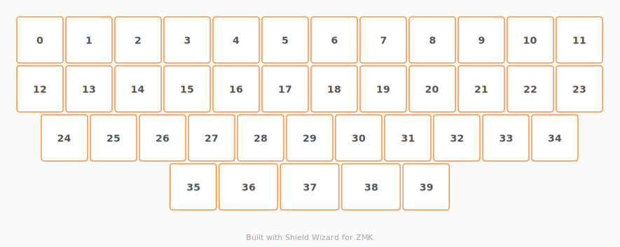

# ZMK Configuration for Prose Mini

*Generated by Shield Wizard for ZMK*



Download compiled firmware from the Actions tab. <https://zmk.dev/docs/user-setup#installing-the-firmware>

Edit your keymap <https://zmk.dev/docs/keymaps>.
User keymap is located at [`config/prose_mini.keymap`](config/prose_mini.keymap).

-----

<details>
<summary>
Shield Wizard Debug Information
</summary>

In case of broken configuration, here is the Shield Wizard internal data used to generate this configuration:

Commit: 1392b26de17a1e3ca0c20f5e46c50c82c64ac828

```json
{"name":"Prose Mini","shield":"prose_mini","dongle":false,"modules":[],"layout":[{"id":"01KXHBVJ44MC7SE1M25MG02DG9","part":0,"row":0,"col":0,"w":1,"h":1,"x":0,"y":0,"r":0,"rx":0,"ry":0},{"id":"01KXHBVJ44Y2AGK1YRKN3NV5VJ","part":0,"row":0,"col":1,"w":1,"h":1,"x":1,"y":0,"r":0,"rx":0,"ry":0},{"id":"01KXHBVJ44C1ZRBEYVTKEJAFF6","part":0,"row":0,"col":2,"w":1,"h":1,"x":2,"y":0,"r":0,"rx":0,"ry":0},{"id":"01KXHBVJ44PTCKX2M51PZVAYYT","part":0,"row":0,"col":3,"w":1,"h":1,"x":3,"y":0,"r":0,"rx":0,"ry":0},{"id":"01KXHBVJ44GEZ19QAF68J55JJZ","part":0,"row":0,"col":4,"w":1,"h":1,"x":4,"y":0,"r":0,"rx":0,"ry":0},{"id":"01KXHBVJ44MCWQ1BZA6WYZDZJX","part":0,"row":0,"col":5,"w":1,"h":1,"x":5,"y":0,"r":0,"rx":0,"ry":0},{"id":"01KXHBVJ44DPCYZQZ80S4H2JFC","part":0,"row":0,"col":6,"w":1,"h":1,"x":6,"y":0,"r":0,"rx":0,"ry":0},{"id":"01KXHBVJ445RYWZ2VA9K6J8V0M","part":0,"row":0,"col":7,"w":1,"h":1,"x":7,"y":0,"r":0,"rx":0,"ry":0},{"id":"01KXHBVJ44MBQ3MNX01FFN0XRB","part":0,"row":0,"col":8,"w":1,"h":1,"x":8,"y":0,"r":0,"rx":0,"ry":0},{"id":"01KXHBVJ448CFRR6CJQQJ7CEHM","part":0,"row":0,"col":9,"w":1,"h":1,"x":9,"y":0,"r":0,"rx":0,"ry":0},{"id":"01KXHBVJ45Y3DWX19N7K1ZXAF6","part":0,"row":0,"col":10,"w":1,"h":1,"x":10,"y":0,"r":0,"rx":0,"ry":0},{"id":"01KXHBVJ45W30ZG8Q0FQZJTDEA","part":0,"row":0,"col":11,"w":1,"h":1,"x":11,"y":0,"r":0,"rx":0,"ry":0},{"id":"01KXHBVJ45KN87Q3MMZPYD98BF","part":0,"row":1,"col":0,"w":1,"h":1,"x":0,"y":1,"r":0,"rx":0,"ry":0},{"id":"01KXHBVJ45C3FVB3ZPFZEG6V8G","part":0,"row":1,"col":1,"w":1,"h":1,"x":1,"y":1,"r":0,"rx":0,"ry":0},{"id":"01KXHBVJ45C75F3HZWCFJ23CZ5","part":0,"row":1,"col":2,"w":1,"h":1,"x":2,"y":1,"r":0,"rx":0,"ry":0},{"id":"01KXHBVJ4551SXN0MNRDQVZZ57","part":0,"row":1,"col":3,"w":1,"h":1,"x":3,"y":1,"r":0,"rx":0,"ry":0},{"id":"01KXHBVJ45ANEA949NRNWMQF72","part":0,"row":1,"col":4,"w":1,"h":1,"x":4,"y":1,"r":0,"rx":0,"ry":0},{"id":"01KXHBVJ459R1T0QC39HQ1RHF4","part":0,"row":1,"col":5,"w":1,"h":1,"x":5,"y":1,"r":0,"rx":0,"ry":0},{"id":"01KXHBVJ456V8B5A36NS3DV68N","part":0,"row":1,"col":6,"w":1,"h":1,"x":6,"y":1,"r":0,"rx":0,"ry":0},{"id":"01KXHBVJ45V2PKKR7DK7NH1P6N","part":0,"row":1,"col":7,"w":1,"h":1,"x":7,"y":1,"r":0,"rx":0,"ry":0},{"id":"01KXHBVJ45Y2NDQVHQGK8XDB69","part":0,"row":1,"col":8,"w":1,"h":1,"x":8,"y":1,"r":0,"rx":0,"ry":0},{"id":"01KXHBVJ45ENBCSNXR4MP2VK9W","part":0,"row":1,"col":9,"w":1,"h":1,"x":9,"y":1,"r":0,"rx":0,"ry":0},{"id":"01KXHBVJ454NMS5978K343N0FX","part":0,"row":1,"col":10,"w":1,"h":1,"x":10,"y":1,"r":0,"rx":0,"ry":0},{"id":"01KXHBVJ454M42N3C3N7JBWZ7N","part":0,"row":1,"col":11,"w":1,"h":1,"x":11,"y":1,"r":0,"rx":0,"ry":0},{"id":"01KXHBVJ45NAHKH5NMRY9C1JMB","part":0,"row":2,"col":0,"w":1,"h":1,"x":0.5,"y":2,"r":0,"rx":0,"ry":0},{"id":"01KXHBVJ45JPC1WB682P8CE2YP","part":0,"row":2,"col":1,"w":1,"h":1,"x":1.5,"y":2,"r":0,"rx":0,"ry":0},{"id":"01KXHBVJ451BGN7GP4TH90GHZR","part":0,"row":2,"col":2,"w":1,"h":1,"x":2.5,"y":2,"r":0,"rx":0,"ry":0},{"id":"01KXHBVJ45XNFJVPAXCS0X9960","part":0,"row":2,"col":3,"w":1,"h":1,"x":3.5,"y":2,"r":0,"rx":0,"ry":0},{"id":"01KXHBVJ45X08Z2TDYWMR3WENX","part":0,"row":2,"col":4,"w":1,"h":1,"x":4.5,"y":2,"r":0,"rx":0,"ry":0},{"id":"01KXHBVJ45MMW2T7NNKC7ZHG2D","part":0,"row":2,"col":5,"w":1,"h":1,"x":5.5,"y":2,"r":0,"rx":0,"ry":0},{"id":"01KXHBVJ45X9VKY3Y522094AH5","part":0,"row":2,"col":6,"w":1,"h":1,"x":6.5,"y":2,"r":0,"rx":0,"ry":0},{"id":"01KXHBVJ45QD6K3FPZCGKXXPGH","part":0,"row":2,"col":7,"w":1,"h":1,"x":7.5,"y":2,"r":0,"rx":0,"ry":0},{"id":"01KXHBVJ458EYQ1FDM6DRE5TRN","part":0,"row":2,"col":8,"w":1,"h":1,"x":8.5,"y":2,"r":0,"rx":0,"ry":0},{"id":"01KXHBVJ45DB884D603A67B7CB","part":0,"row":2,"col":9,"w":1,"h":1,"x":9.5,"y":2,"r":0,"rx":0,"ry":0},{"id":"01KXHBVJ45YMNZK4MP9CH4S4YG","part":0,"row":2,"col":10,"w":1,"h":1,"x":10.5,"y":2,"r":0,"rx":0,"ry":0},{"id":"01KXHBVJ45G0RG7Y07EH14PA4R","part":0,"row":3,"col":3,"w":1,"h":1,"x":3.125,"y":3,"r":0,"rx":0,"ry":0},{"id":"01KXHBVJ45P653X27TVXFP2CAW","part":0,"row":3,"col":4,"w":1.25,"h":1,"x":4.125,"y":3,"r":0,"rx":0,"ry":0},{"id":"01KXHBVJ4503SY00PNX9VA8CHZ","part":0,"row":3,"col":5,"w":1.25,"h":1,"x":5.375,"y":3,"r":0,"rx":0,"ry":0},{"id":"01KXHBVJ45NG44CZ7WSC6N754C","part":0,"row":3,"col":6,"w":1.25,"h":1,"x":6.625,"y":3,"r":0,"rx":0,"ry":0},{"id":"01KXHBVJ45SRA3K2QJJVPTZ4QT","part":0,"row":3,"col":7,"w":1,"h":1,"x":7.875,"y":3,"r":0,"rx":0,"ry":0}],"parts":[{"name":"unibody","controller":"rpi_pico","pins":{"gp4":{"usage":"kscan","kscan":"01KXHBZ24FKZ8PBQFSYY28JWMS","role":"input"},"gp5":{"usage":"kscan","kscan":"01KXHBZ24FKZ8PBQFSYY28JWMS","role":"input"},"gp6":{"usage":"kscan","kscan":"01KXHBZ24FKZ8PBQFSYY28JWMS","role":"input"},"gp7":{"usage":"kscan","kscan":"01KXHBZ24FKZ8PBQFSYY28JWMS","role":"input"},"gp8":{"usage":"kscan","kscan":"01KXHBZ24FKZ8PBQFSYY28JWMS","role":"output"},"gp9":{"usage":"kscan","kscan":"01KXHBZ24FKZ8PBQFSYY28JWMS","role":"output"},"gp10":{"usage":"kscan","kscan":"01KXHBZ24FKZ8PBQFSYY28JWMS","role":"output"},"gp11":{"usage":"kscan","kscan":"01KXHBZ24FKZ8PBQFSYY28JWMS","role":"output"},"gp12":{"usage":"kscan","kscan":"01KXHBZ24FKZ8PBQFSYY28JWMS","role":"output"},"gp13":{"usage":"kscan","kscan":"01KXHBZ24FKZ8PBQFSYY28JWMS","role":"output"},"gp14":{"usage":"kscan","kscan":"01KXHBZ24FKZ8PBQFSYY28JWMS","role":"output"},"gp15":{"usage":"kscan","kscan":"01KXHBZ24FKZ8PBQFSYY28JWMS","role":"output"},"gp16":{"usage":"kscan","kscan":"01KXHBZ24FKZ8PBQFSYY28JWMS","role":"output"},"gp17":{"usage":"kscan","kscan":"01KXHBZ24FKZ8PBQFSYY28JWMS","role":"output"},"gp18":{"usage":"kscan","kscan":"01KXHBZ24FKZ8PBQFSYY28JWMS","role":"output"},"gp19":{"usage":"kscan","kscan":"01KXHBZ24FKZ8PBQFSYY28JWMS","role":"output"}},"kscans":[{"kind":"matrix","id":"01KXHBZ24FKZ8PBQFSYY28JWMS","diodes":true}],"keys":{"01KXHBVJ44MC7SE1M25MG02DG9":{"input":"gp4","output":"gp8"},"01KXHBVJ44Y2AGK1YRKN3NV5VJ":{"input":"gp4","output":"gp9"},"01KXHBVJ44C1ZRBEYVTKEJAFF6":{"input":"gp4","output":"gp10"},"01KXHBVJ44PTCKX2M51PZVAYYT":{"input":"gp4","output":"gp11"},"01KXHBVJ44GEZ19QAF68J55JJZ":{"input":"gp4","output":"gp12"},"01KXHBVJ44MCWQ1BZA6WYZDZJX":{"input":"gp4","output":"gp13"},"01KXHBVJ44DPCYZQZ80S4H2JFC":{"input":"gp4","output":"gp14"},"01KXHBVJ445RYWZ2VA9K6J8V0M":{"input":"gp4","output":"gp15"},"01KXHBVJ44MBQ3MNX01FFN0XRB":{"input":"gp4","output":"gp16"},"01KXHBVJ448CFRR6CJQQJ7CEHM":{"input":"gp4","output":"gp17"},"01KXHBVJ45Y3DWX19N7K1ZXAF6":{"input":"gp4","output":"gp18"},"01KXHBVJ45W30ZG8Q0FQZJTDEA":{"input":"gp4","output":"gp19"},"01KXHBVJ45KN87Q3MMZPYD98BF":{"input":"gp5","output":"gp8"},"01KXHBVJ45C3FVB3ZPFZEG6V8G":{"input":"gp5","output":"gp9"},"01KXHBVJ45C75F3HZWCFJ23CZ5":{"input":"gp5","output":"gp10"},"01KXHBVJ4551SXN0MNRDQVZZ57":{"input":"gp5","output":"gp11"},"01KXHBVJ45ANEA949NRNWMQF72":{"input":"gp5","output":"gp12"},"01KXHBVJ459R1T0QC39HQ1RHF4":{"input":"gp5","output":"gp13"},"01KXHBVJ456V8B5A36NS3DV68N":{"input":"gp5","output":"gp14"},"01KXHBVJ45V2PKKR7DK7NH1P6N":{"input":"gp5","output":"gp15"},"01KXHBVJ45Y2NDQVHQGK8XDB69":{"input":"gp5","output":"gp16"},"01KXHBVJ45ENBCSNXR4MP2VK9W":{"input":"gp5","output":"gp17"},"01KXHBVJ454NMS5978K343N0FX":{"input":"gp5","output":"gp18"},"01KXHBVJ454M42N3C3N7JBWZ7N":{"input":"gp5","output":"gp19"},"01KXHBVJ45NAHKH5NMRY9C1JMB":{"input":"gp6","output":"gp8"},"01KXHBVJ45JPC1WB682P8CE2YP":{"input":"gp6","output":"gp9"},"01KXHBVJ451BGN7GP4TH90GHZR":{"input":"gp6","output":"gp10"},"01KXHBVJ45XNFJVPAXCS0X9960":{"input":"gp6","output":"gp11"},"01KXHBVJ45X08Z2TDYWMR3WENX":{"input":"gp6","output":"gp12"},"01KXHBVJ45MMW2T7NNKC7ZHG2D":{"input":"gp6","output":"gp13"},"01KXHBVJ45X9VKY3Y522094AH5":{"input":"gp6","output":"gp14"},"01KXHBVJ45QD6K3FPZCGKXXPGH":{"input":"gp6","output":"gp15"},"01KXHBVJ458EYQ1FDM6DRE5TRN":{"input":"gp6","output":"gp16"},"01KXHBVJ45DB884D603A67B7CB":{"input":"gp6","output":"gp17"},"01KXHBVJ45YMNZK4MP9CH4S4YG":{"input":"gp6","output":"gp18"},"01KXHBVJ45G0RG7Y07EH14PA4R":{"input":"gp7","output":"gp11"},"01KXHBVJ45P653X27TVXFP2CAW":{"input":"gp7","output":"gp12"},"01KXHBVJ4503SY00PNX9VA8CHZ":{"input":"gp7","output":"gp13"},"01KXHBVJ45NG44CZ7WSC6N754C":{"input":"gp7","output":"gp14"},"01KXHBVJ45SRA3K2QJJVPTZ4QT":{"input":"gp7","output":"gp15"}},"encoders":[],"buses":{}}]}
```

</details>
